# 虐待防止・苦情問い合わせセンター 連絡先リスト自動更新ツール

## 概要

就労移行支援事業所で使用されている「虐待防止・苦情問い合わせ先リスト」の更新作業を自動化するために開発したRPAです。

事業所では、利用者が安心してサービスを利用できるよう、虐待防止や苦情相談に関する行政機関・相談窓口の連絡先リストをスプレッドシートで管理していました。

しかし、既存リストが最新情報へ十分に更新されておらず、更新するには以下の作業を手作業で行う必要がありました。

- 東京都福祉局が公開する最新資料の確認
- PDF / Excel資料からの連絡先情報の転記
- 各機関の公式Webサイトの検索
- 検索結果から公式サイトかどうかの判定
- URLの取得
- Excelへの転記・整形

対象件数が多く、Webサイトごとに構造も異なるため、手作業では大きな作業負荷が発生します。

そこで、東京都内の虐待防止・苦情相談窓口を主な対象として、UiPathとGemini APIを組み合わせ、資料取得からWeb検索、公式サイト判定、Excelへの出力・整形までを自動化しました。

一度だけリストを更新するのではなく、定期的な更新を簡単に行えるようにし、支援スタッフが連絡先リストを最新の状態に保ちやすくすることを目的としています。

### 開発の進め方・担当範囲

支援スタッフへのヒアリングを通じて業務上の要望を確認し、別のメンバーが作成した要件定義書をもとに、本ツールを実装しました。大まかなフローはありましたが、ほとんどの具体的な処理の方法は独力で設計しました。

開発中も支援スタッフと認識をすり合わせ、要望や運用方法を調整しながら作成しました。自分の担当は、要望の聞き取り・調整と、それを踏まえたRPAの実装です。

## 主な機能

- 東京都福祉局の公開資料を取得
- ダウンロードした資料から対象機関の情報を取得
- Google検索を利用して各機関のWebサイトを検索
- 検索結果から候補URLを取得
- Webページ本文を取得
- Gemini APIを利用して公式サイトかどうかを判定
- 判定した公式URLをExcelへ書き込み
- VBAを利用したハイパーリンク設定
- Excelの列幅・行高・表示形式を自動調整
- Webページ取得失敗時のリトライ
- Gemini API通信失敗時のリトライ
- 例外発生時のログ出力
- 処理結果を日付付きExcelファイルとして保存
- 作成したファイルをGoogle Driveへアップロード

## 処理フロー

1. 東京都福祉局の公開ページへアクセス
2. 最新の虐待防止・苦情相談関連資料を取得
3. 資料をExcelとして処理可能な状態にする
4. 対象機関を1件ずつ読み込む
5. Google検索から候補URLを取得
6. 候補ページへアクセスしてページ本文を取得
7. Gemini APIへページ情報を送信
8. 対象機関の公式ページかどうかを判定
9. 公式URLをExcelへ書き込む
10. ハイパーリンク・列幅・行高などを整形
11. 日付付きの更新済みファイルとして保存
12. Google Driveへアップロード

※Web検索・Gemini APIによる公式URL判定は、`Main1.xaml` の虐待防止リスト作成で行います。`Main2.xaml` では、東京都社会福祉協議会の公開PDFを取得してExcelへ変換し、苦情相談の連絡先・リンクを取り出します。

## ワークフロー構成

処理量が多いため、ワークフローを複数ファイルに分割しています。

- `MainALL.xaml`
  - 全体処理を統括するメインワークフロー。`config.xlsx` から作業フォルダのパスを読み込み、`Main1.xaml` → `Main2.xaml` → `Main3.xaml` の順に実行します。
- `Main1.xaml`
  - 虐待防止リストを作成します。東京都福祉局の公開資料取得、Web検索、ページ本文取得、Gemini APIによる公式URL判定、Excelへの反映・整形・保存を行います。
- `Main2.xaml`
  - 苦情相談リストを作成します。東京都社会福祉協議会の公開PDF取得、PDFからExcelへの変換、連絡先・リンクの抽出、Excelへの反映・整形・保存を行います。
- `Main3.xaml`
  - 作成した日付付きファイルをGoogle Driveへアップロードします。実行前に、利用者自身のGoogleアカウントとの接続設定が必要です。

`FlowImages` フォルダには、各ワークフローの構成を確認できる画像を格納しています。

## ワークフロー画像

### MainALL

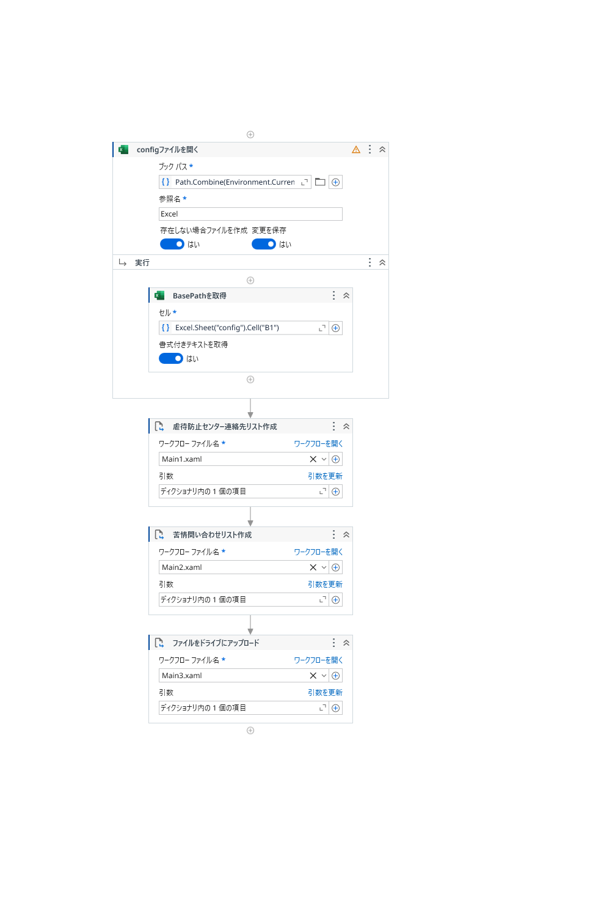

### Main1

画像は [`FlowImages/Main1/`](FlowImages/Main1/) に、`1.png` から `12.png` までの順番で格納しています。

Main1のワークフロー画像を表示（12枚）

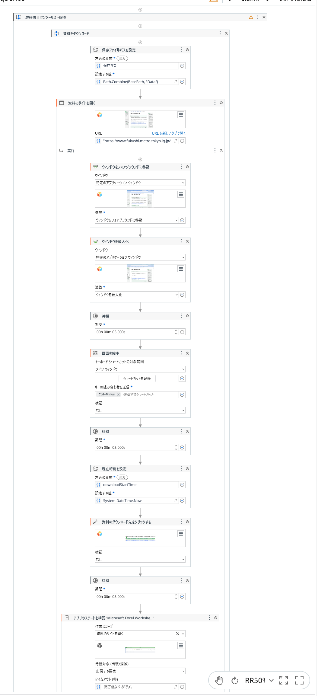

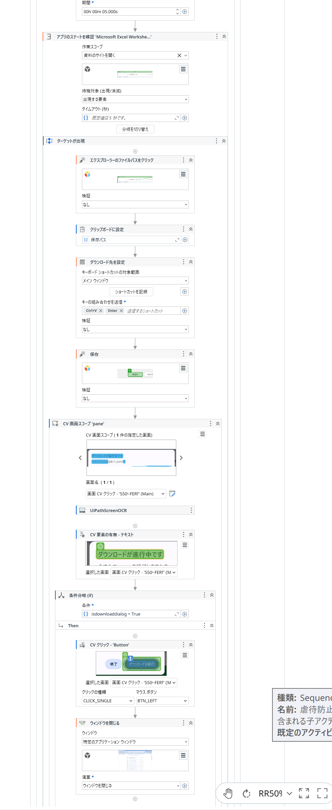

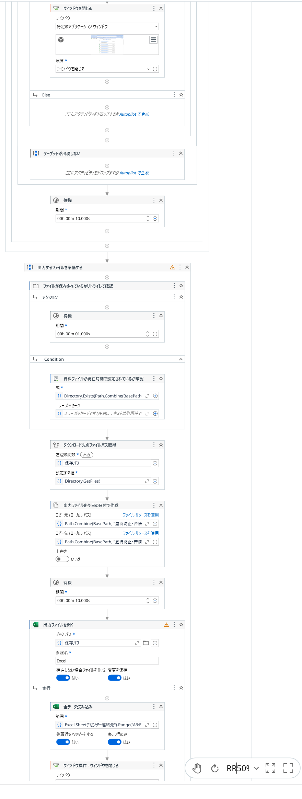

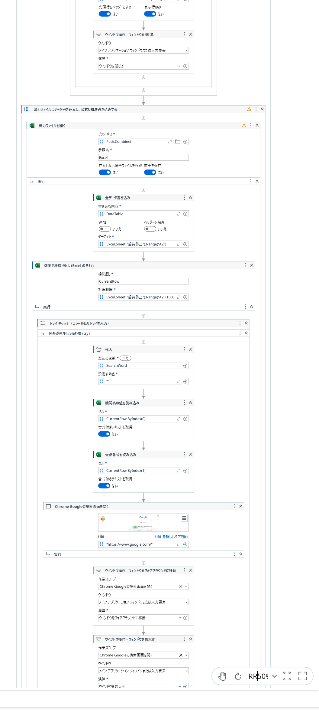

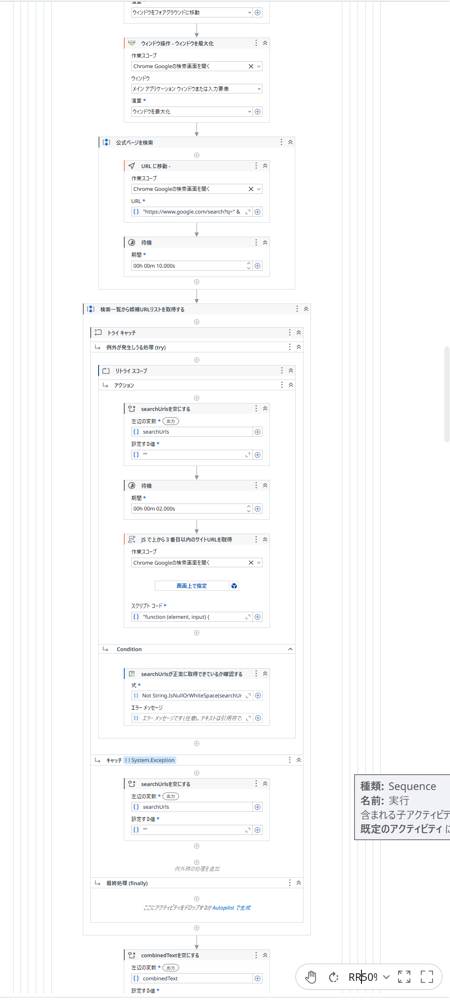

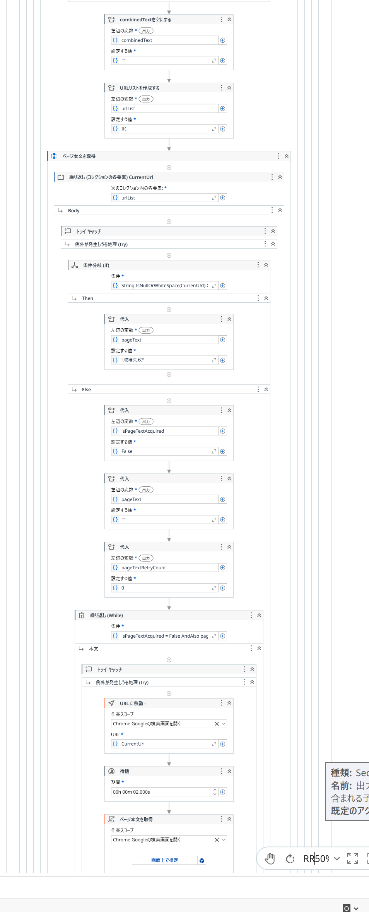

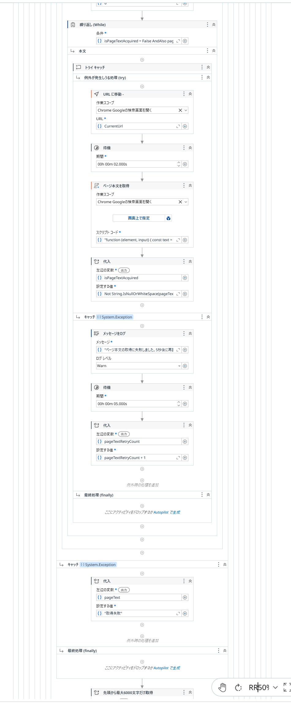

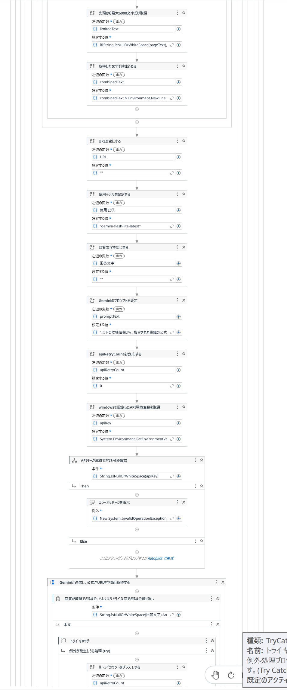

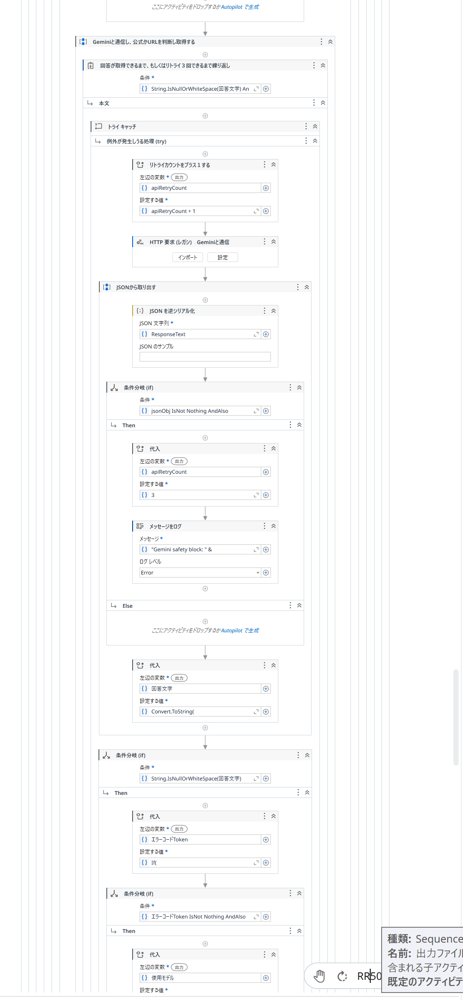

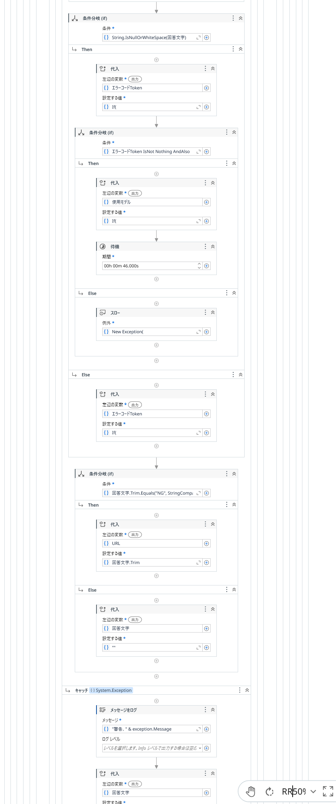

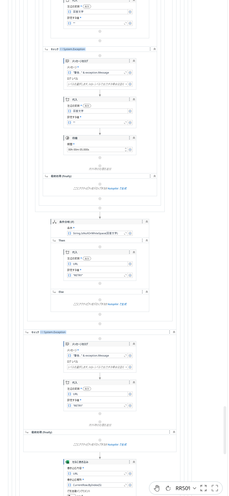

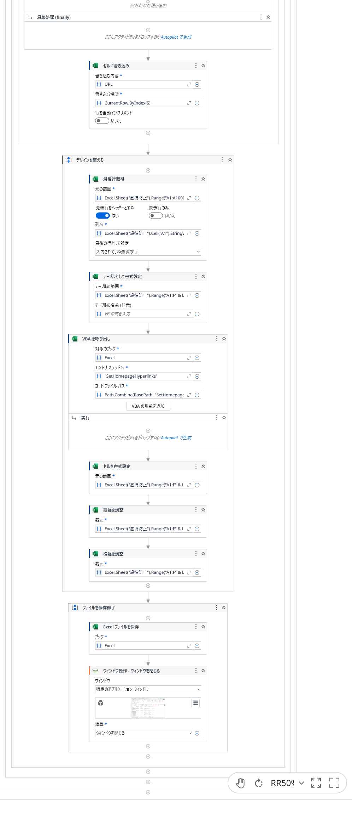

### Main2

画像は [`FlowImages/Main2/`](FlowImages/Main2/) に、`1.png` から `6.png` までの順番で格納しています。

Main2のワークフロー画像を表示（6枚）

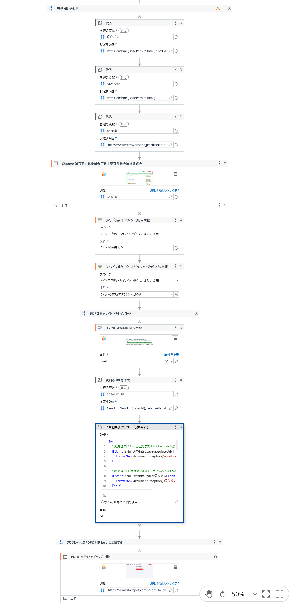

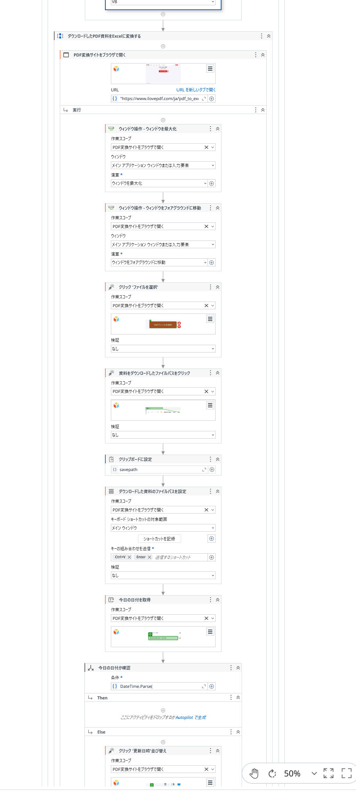

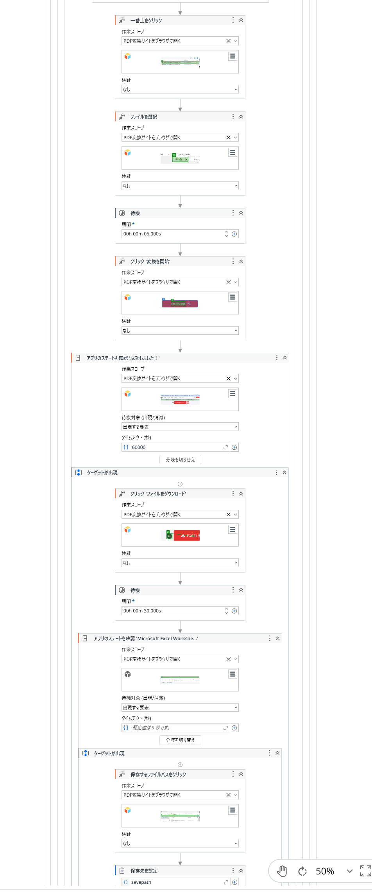

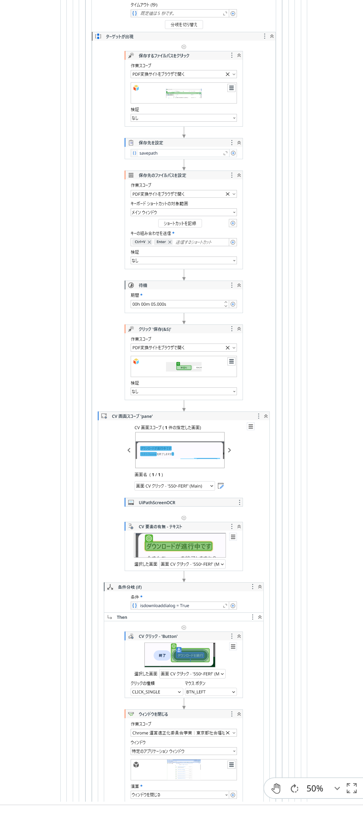

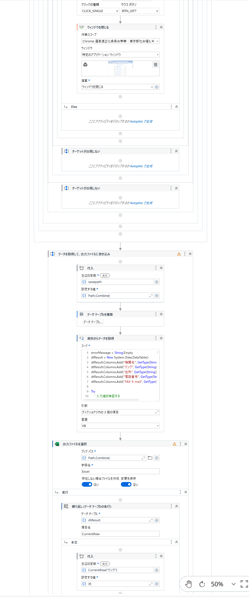

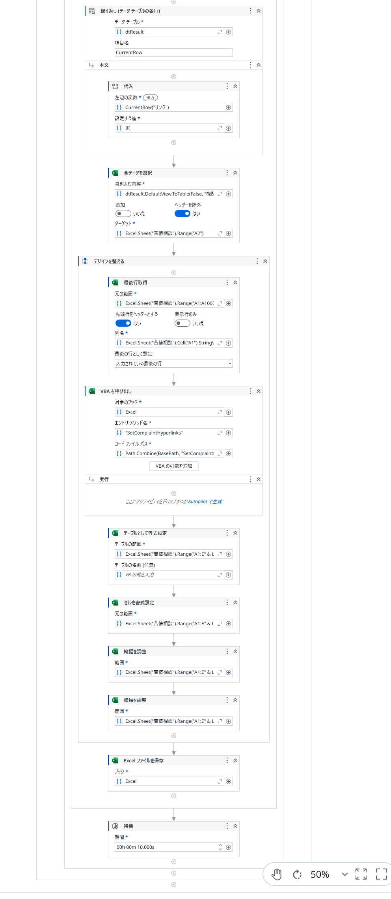

### Main3

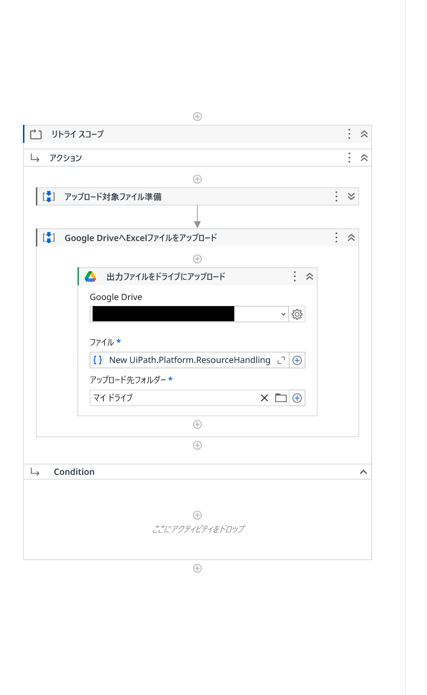

## 使用技術

- UiPath Studio
- Microsoft Excel
- VBA
- Gemini API
- HTTP / JSON
- JavaScript
- Google検索
- Windows環境変数
- Google Drive / UiPath Integration Service

## 動作デモ

実際にRPAを実行している様子を以下の動画で確認できます。

[YouTube：虐待防止・苦情問い合わせ先リスト更新RPA 動作デモ](https://www.youtube.com/watch?v=-RRehAegv2U)

※処理時間を短縮して確認できるよう、動画の一部を倍速で再生しています。

## 工夫した点・技術的課題

### 1. Webサイトごとの構造差への対応

対象となる自治体・関係機関のWebサイトは、HTML構造やページ構成が統一されていません。

特定のCSSセレクタだけに依存する方式ではなく、検索結果から候補URLを取得し、ページ本文を取得した上で生成AIによる判定を行う構成としました。

### 2. Gemini APIによる公式ページ判定

Google検索の上位結果が必ずしも対象機関の公式ページとは限らないため、候補ページの情報をGemini APIへ送信し、対象機関の公式ページとして妥当かを判定しています。

APIキーはソースコードへ直接記述せず、Windowsの環境変数から取得する構成としています。

### 3. Webページ取得失敗への対応

Webサイトの読み込み速度や通信状態によってページ本文を取得できない場合があるため、取得失敗時には一定時間待機して再試行する処理を実装しています。

これにより、一時的なページ表示遅延による処理停止を減らしています。

### 4. APIエラーへの対応

Gemini APIへの通信についても、通信エラーや一時的なAPIエラーを想定してリトライ処理を実装しています。

エラー発生時にはログを出力し、原因を確認できるようにしています。

### 5. Excel出力の自動整形

取得したURLを書き込むだけでなく、VBAを利用したハイパーリンク設定や、列幅・行高などの表示調整も自動化しています。

処理完了後に利用者がそのまま確認しやすいExcelファイルになることを意識しました。

### 6. ダウンロード遅延・ポップアップへの対応

資料のダウンロードが遅れ、ポップアップ画面が表示されることがあったため、想定するダイアログへの対応を組み込みました。

`Main1.xaml` と `Main2.xaml` では、Computer Vision（画面上の文字やボタンを認識する機能）でダウンロード進行中のダイアログの有無を確認し、検出した場合にダウンロード続行のボタンを操作する条件分岐を設けています。ポップアップが表示された場合と、表示されない場合で処理を分けています。

また、`Main1.xaml` ではダウンロード開始時刻を保持し、`Data` フォルダに開始時刻以降の更新日時を持つExcelファイルがあるかを、待機とリトライを組み合わせて確認します。古いファイルが残っているだけで、今回の資料取得が完了したと判断しないための工夫です。

※対象はワークフローで指定したダイアログです。あらゆるポップアップへの対応や、どのような遅延でも必ず処理を継続できることを保証するものではありません。

実装箇所：[Main1.xaml](Main1.xaml) ／ [Main2.xaml](Main2.xaml) ／ [ダウンロード画面への対応](FlowImages/Main1/2.png)

### 7. 業務・工程ごとのワークフロー分割

処理全体を1つのワークフローにまとめず、`MainALL.xaml` で実行順序を管理し、虐待防止リスト作成を `Main1.xaml`、苦情相談リスト作成を `Main2.xaml`、Google Driveへのアップロードを `Main3.xaml` に分けています。

業務・工程ごとに処理を分けることで、取得元の変更や不具合が発生した場合に、どのワークフローを確認するか把握しやすい構成にしています。各ワークフローの中でも、資料取得・Web検索・ページ本文取得・API判定・出力整形などをシーケンスにまとめています。

構成図：[MainALLのワークフロー](FlowImages/MainALL.png)

### 8. エラー処理の具体例

正常に動く場合だけでなく、情報を取得できない場合や外部サービスからエラーが返る場合も考慮し、処理段階ごとに確認・再試行・失敗結果の記録を組み込んでいます。

#### Gemini APIの応答・通信に対する処理（Main1）

| 想定する状況 | 実装している処理 |
|---|---|
| APIキーが未設定・空欄 | ユーザー環境変数 `GEMINI_API_KEY` を確認し、取得できない場合は設定不足を示す例外を発生させます。 |
| 回答が空欄で、JSON応答の `error.code` が `429`・`500`・`502`・`503`・`504` | 再試行対象のコードとして分岐し、使用モデルを `gemini-flash-lite-latest` と `gemini-flash-latest` の間で切り替え、46秒待機します。上限に達していなければ再送します。 |
| 通信・JSON解析などで例外が発生 | `Try Catch` で例外内容をログに残し、回答を空欄に戻して5秒待機します。API呼び出し回数が上限未満であれば再試行します。 |
| 応答が長時間返らない | HTTP要求に180秒のタイムアウトを設定しています。通信が例外になった場合は、上記の例外処理で扱います。 |
| API応答にブロック理由がある | `promptFeedback.blockReason` の存在を確認して理由をエラーログへ出力し、呼び出し回数を上限に設定して、それ以降のループ再送を止めます。 |
| 回答が候補URLにも `NG` にも一致しない | 回答をそのまま採用せず、空欄に戻して再試行対象とします。検索で取得していないURLを回答された場合の対策です。 |
| 再試行後も有効な回答を取得できない | API呼び出しは初回を含め最大3回とし、回答が空欄のまま終了した場合は、出力するURL欄を `RETRY` にします。 |

上記5種類以外の `error.code` で回答が空欄の場合も、例外を発生させて共通の `Catch` で内容を記録します。ただし、現在のコードでは、その例外も回数上限までは再試行されます。エラーの種類ごとに即時終了・設定修正・復旧をすべて自動判断する設計ではありません。

`NG` は候補の中から該当する公式URLを選べなかった場合、`RETRY` は有効な回答を取得できなかった場合や、機関ごとの処理で例外が発生した場合の出力として区別しています。`RETRY` を書き込む処理は確認対象を残すためのもので、後からその行だけを自動再実行する機能ではありません。

実装箇所：[Main1.xaml](Main1.xaml)

#### Web取得・ファイル処理・アップロードに対する処理

| 処理段階 | 実装している処理 |
|---|---|
| 検索結果から候補URLを取得（Main1） | `Retry Scope` で取得を繰り返し、結果が空欄でないことを確認します。例外として終了した場合は、候補URLの文字列を空欄に戻します。 |
| 候補ページの本文を取得（Main1） | 例外が発生した場合に警告ログを出力し、5秒待機して再試行します。例外発生時にカウントを加算し、3回未満の間、本文取得を試みる条件を設けています。 |
| 機関ごとの処理で例外が発生（Main1） | 外側の `Try Catch` で例外内容をログに残し、その行のURL欄に `RETRY` を書き込む構成です。 |
| PDFをダウンロード（Main2） | URL・保存パスの空欄、保存先フォルダの存在を確認します。失敗時はURL・保存パス・例外内容を表示し、例外を再送出して後続へ失敗を伝えます。 |
| PDFからExcelへの変換待ち（Main2） | 「成功しました！」という画面要素の出現を最大60秒待つ設定にし、出現を確認した場合にダウンロード操作へ進みます。 |
| Google Driveへアップロード（Main3） | ファイル準備とアップロードを `Retry Scope` で囲み、再試行回数を3回、間隔を10秒に設定しています。失敗を無視して続行する設定にはしていません。 |

※ページ本文取得のカウントは例外発生時に加算する実装です。例外にならず本文だけが空欄の場合まで、同じ回数で終了することを保証するものではありません。

※ここで記載しているのは実装上の対策です。「Geminiの全エラーコードに個別対応済み」「すべての異常系を再現して試験済み」という意味ではありません。

実装箇所：[Main1.xaml](Main1.xaml) ／ [Main2.xaml](Main2.xaml) ／ [Main3.xaml](Main3.xaml)

## 精度・テスト

### 検証対象・評価方法

全11ファイルの「虐待防止」シートを対象に、**93機関・延べ1,023件**の機関名と「ホームページ」のリンクを公式情報と照合した結果をまとめています。各ファイルは93件で、同じ93機関について11ファイル分の出力結果を評価したものです。元の出力ファイルは変更していません。

評価対象は、リンク先が対象機関・部署の紹介や相談窓口の案内として適切かどうかです。検索で見つけた推奨URLと異なっていても、対象機関の公式紹介として適切なページは正答としています。

### 全体の結果

**今回の判定基準では、正答率は87.78％（約88％）、最適ではない率は7.43％、明らかなミス率は3.91％でした。**

分母は、リンク未設定も含めた**全1,023件**です。

| 判定 | 件数 | 割合 | 今回の基準 |
|---|---:|---:|---|
| 適切・正答 | 898件 | 87.78％ | 対象機関・部署の公式紹介、または対象窓口の案内になっている |
| 最適ではない | 76件 | 7.43％ | 関連する公式ページだが、FAQ・一般問い合わせ・中間一覧などで案内が間接的 |
| 明らかなミス | 40件 | 3.91％ | 機関紹介や相談案内ではなく、別用途の記事・会議資料・手続案内に飛ぶ |
| リンク未設定 | 9件 | 0.88％ | `RETRY`・`NG` によりURLが入っていない |
| **合計** | **1,023件** | **100.00％** | |

**明らかなミス率3.91％は、40件 ÷ 全1,023件で算出しています。** 「最適ではない」76件や「リンク未設定」9件とは重複させずに分類しています。

「最適ではない」と「明らかなミス」を合わせると116件／1,023件＝11.34％です。リンク未設定も含めると、何らかの問題があるものは125件／1,023件＝12.22％となります。

また、未設定9件を除き、実際にURLが出力された1,014件だけを分母にした正答率は、898件／1,014件＝88.56％です。

### 検証結果を踏まえた運用方針（支援スタッフとの合意）

この検証結果を踏まえて支援スタッフと相談し、**虐待防止シートに出力されたURLは、利用者向けに反映する前に必ず一度ずつ開き、対象機関の案内であることや、明らかな誤りがないことを確認する運用**で合意しました。

自動取得した結果をそのまま確定情報として扱わず、RPAによる検索・転記の自動化と、人によるリンク先の最終確認を組み合わせる方針です。

### 判定の具体例

明らかなミスと「最適ではない」の具体例を表示

**明らかなミス：4種類・延べ40件**

同じ自治体の公式サイトであっても、ページの用途が明確に違うものをミスとしています。

| 機関・元のセル | 該当件数 | 実際のリンク先・判定理由 |
|---|---:|---|
| 板橋区障がいサービス課支援調整係・F26 | 7件 | 個別避難計画の説明。同じ担当係だが、機関紹介・虐待相談案内ではない |
| 足立区障がい援護課基幹相談・権利擁護係・F37 | 11件 | 権利擁護部会の会議・資料ページ。相談窓口の案内とは用途が異なる |
| 利島村住民課・F87 | 11件 | 住民票・戸籍などの各種届出の説明。住民課全体の紹介や障害者相談の案内ではない |
| 八丈町福祉健康課・F92 | 11件 | 予防接種関係の申請書ページ。課の紹介・障害者相談案内とは異なる |

この40件は、別の自治体への取り違えではなく、正しい自治体の中で違うページを選んでいるミスです。

**「最適ではない」の具体例**

国分寺市障害福祉課は8件がFAQ一覧でした。ページの見出しは「障害福祉課」ですが、内容は質問一覧のため、課の業務・相談窓口の紹介ページとは区別しています。

昭島市障害者虐待防止センターは9件が、同じ運営法人の「障害者相談支援センター」の案内でした。関連する機関ではありますが、虐待防止センターの専用窓口を明記した市公式ページの方が直接的です。

一方、「もっと直接的なページが存在する」という理由だけで、すべてを減点したわけではありません。対象機関の公式紹介として適切なものは正答としています。

### ファイル別の結果

全11ファイルの件数・正答率を表示

ファイル名は共通部分の「虐待防止・苦情問い合わせ連絡先_」を省略しています。各ファイルとも93件です。

| ファイル名の末尾 | 適切・正答 | 最適ではない | 明らかなミス | 未設定 | 正答率 |
|---|---:|---:|---:|---:|---:|
| 20260831(2).xlsx | 81 | 7 | 3 | 2 | 87.10％ |
| 20260831_2(1).xlsx | 82 | 6 | 3 | 2 | 88.17％ |
| 20260831_3.xlsx | 82 | 6 | 3 | 2 | 88.17％ |
| 20260901(1).xlsx | 80 | 8 | 4 | 1 | 86.02％ |
| 20260902.xlsx | 80 | 9 | 4 | 0 | 86.02％ |
| 20260902②.xlsx | 82 | 7 | 4 | 0 | 88.17％ |
| 20260902③.xlsx | 82 | 6 | 4 | 1 | 88.17％ |
| 20260902④.xlsx | 82 | 7 | 4 | 0 | 88.17％ |
| 20260904.xlsx | 82 | 7 | 4 | 0 | 88.17％ |
| 20260904⑤.xlsx | 83 | 7 | 3 | 0 | 89.25％ |
| 20260906(1).xlsx | 82 | 6 | 4 | 1 | 88.17％ |
| **合計** | **898** | **76** | **40** | **9** | **87.78％** |

### 数値の読み方と確認上の限界

「適切・正答」「最適ではない」などの分類は、上記の判定基準に依存します。一般問い合わせページなど判断の余地があるものは、検証用Excelで「分類判断の確度＝中」としています。

照合には公式ページ本文と公式検索結果の両方を使用しています。すべてのURLについて現在の直接アクセス成功まで確認できたわけではなく、取得失敗をそのままリンク切れとは扱っていません。

**今回の数値は、リンク先の内容・選択の適切さの評価であり、接続成功率ではありません。また、電話番号・住所などを含めた全項目の正答率や、「苦情相談」シートの正答率を示すものではありません。**

検証結果資料：`虐待防止シート_ホームページリンク検証結果_20260906.xlsx`

同資料には全件の判定理由・修正候補・ファイル別集計をまとめています。「要確認リンク」シートには、見直し対象の機関名・元セル・現在のURL・判定理由・代替URL・該当ファイルを記載しています。

### 検証結果の例

RPAで取得した「虐待防止」シートのホームページURLについて、公式情報と照合し、正答・最適ではない・明らかなミス・未設定に分類して確認しました。

以下のスプレッドシートでは、実際の検証結果の一例を確認できます。

[📊 福祉連絡先URL 検証結果を見る](https://docs.google.com/spreadsheets/d/1VgzqyBb9mvdwpA3zERRJRiYsg7rezPA6Kgv_y_suHsY/edit?gid=1974494536#gid=1974494536)

※取得結果をそのまま確定情報として扱わず、実際の運用ではリンク先を人が確認する前提としています。

## テストで確認した内容

- 通常時の資料取得
- 複数機関の連続処理
- Webページ取得失敗時の再試行
- API通信失敗時の再試行
- Gemini APIから回答を取得できない場合の処理
- 公式URLを取得できなかった場合の処理
- ExcelへのURL書き込み
- VBAによるハイパーリンク設定
- 出力ファイルの保存
- 処理結果の目視確認
- 取得URLと公式情報の照合

## 既知の制約

- WebサイトのHTML構造が大幅に変更された場合、情報を取得できなくなる可能性があります。
- Google検索結果の構造変更により、候補URL取得処理の修正が必要になる可能性があります。
- Gemini APIの回答は常に同一とは限らないため、完全な正確性を保証するものではありません。
- 対象サイトの通信状態や表示速度によって処理時間が変動します。
- 東京都福祉局の公開ページ自体の構造が変更された場合、資料取得部分の修正が必要になる可能性があります。
- 現在は東京都内の対象機関を中心とした構成です。

## 継続開発・今後の改善点

現在も開発を継続しています。

今後は東京都だけでなく、埼玉県・神奈川県・千葉県などの連絡先情報にも対応範囲を広げたいと考えています。地域ごとの公開資料やWebサイトの構成に合わせて、取得・加工処理を追加する予定です。

あわせて、定期的な更新をより簡単に行えるよう、設定手順や実行手順を整備していきます。

## 実行環境

- OS：Windows
- RPA：UiPath Studio
- Excel：Microsoft Excel
- 外部API：Gemini API

UiPath Studioの詳細バージョン：要確認

## 実行に必要なもの

- UiPath Studio
- Microsoft Excel
- Gemini APIキー
- インターネット接続
- Google Chrome
- UiPathアカウント（Studio・Integration Serviceの利用に必要な権限）
- アップロード先のGoogleアカウント

Gemini APIキーはWindowsの環境変数へ設定して使用します。

APIキーなどの認証情報は、このGitHubリポジトリには含めていません。

## 実行方法・事前設定（Windows）

### 1. UiPath Studioをインストールする

1. [UiPath公式のインストール案内](https://docs.uipath.com/ja/studio/standalone/latest/user-guide/install-studio)を開きます。
2. UiPath Automation Cloudへサインインし、リソースセンター／ダウンロードから、利用するライセンスに対応したStudioのインストーラーを取得します。
3. インストーラーを実行し、ライセンス条項を確認して、UiPath Studioをインストールします。
4. インストール後にUiPath Studioを起動し、サインイン・ライセンスの有効化を完了します。

このプロジェクトでは、Windows用のデスクトップ版UiPath Studioを使用します。Assistantだけではなく、ワークフローを開いて設定できるStudioを用意してください。

Microsoft Excelのデスクトップ版とGoogle Chromeも、あらかじめインストールしてください。

### 2. プロジェクトを開く

1. リポジトリ全体をダウンロードし、ZIPの場合は展開します。
2. プロジェクトを任意の作業フォルダに保存します。以下では `C:\福祉資料更新` を例とします。
3. UiPath Studioで、作業フォルダ内の `project.json` を開きます。
4. プロジェクトの依存関係が復元されるまで待ちます。パッケージの不足が表示された場合は、[パッケージを管理] から、プロジェクトに指定された依存関係を確認してください。

必要なパッケージのバージョンは `project.json` の記載を基準とします。UiPath Studio本体の動作確認バージョンは、上記の「実行環境」に追記予定です。

手順参考：[UiPath公式：依存関係を管理する](https://docs.uipath.com/ja/studio/standalone/latest/user-guide/managing-dependencies)

### 3. Google ChromeのUiPath拡張機能を確認する

1. UiPath Studioの [ホーム] → [ツール] → [UiPath拡張機能] を開きます。
2. [Chrome] の [インストール] から、利用環境に対応した方法で拡張機能をインストールします。
3. Chromeの拡張機能管理画面で、UiPath Browser Automationが有効になっていることを確認します。

既に導入済みの場合は、有効になっていることを確認してください。

手順参考：[UiPath公式：Chrome拡張機能](https://docs.uipath.com/ja/studio/standalone/latest/user-guide/extension-for-chrome)

### 4. config.xlsxに作業フォルダのパスを設定する

1. エクスプローラーで、このプロジェクトを置いたフォルダを開きます。
2. アドレスバーをクリックし、現在のフォルダのフルパスをコピーします。
3. 同じフォルダ内の `config.xlsx` をExcelで開きます。
4. `config` シートの **B1セル** に、コピーしたフォルダパスを入力します。
5. 保存してExcelを閉じます。

例えば `C:\福祉資料更新` にプロジェクトを置いた場合、B1セルには `C:\福祉資料更新` と入力します。

指定するのは **`config.xlsx` 自体のパスではなく、プロジェクトを置いたフォルダのパス**です。パスを囲む引用符は入力しません。

`MainALL` の画像では、`Excel.Sheet("config").Cell("B1")` から `BasePath` を取得しています。[設定を読み取る処理の画像](FlowImages/MainALL.png)

`Data` フォルダ、出力用テンプレート、`SetHomepageHyperlinks.txt`、`SetComplaintHyperlinks.txt` は、プロジェクトの所定の場所に残してください。作業フォルダを移動した場合は、B1セルも更新します。

### 5. Gemini APIキーをWindowsのユーザー環境変数に設定する

**環境変数名は `GEMINI_API_KEY` です。**

`Main1.xaml` は `System.EnvironmentVariableTarget.User` を指定しているため、**このRPAを実行するWindowsユーザーの環境変数**に設定してください。システム環境変数だけに設定しても、このコードの参照先とは一致しません。

1. [Google AI Studio](https://aistudio.google.com/)にログインし、自分のGemini APIキーを取得します。
2. Windowsのスタートメニューで「環境変数」と検索し、[システムの環境変数の編集] を開きます。
3. [詳細設定] タブの [環境変数] をクリックします。
4. 上段の **[ユーザー環境変数]** にある [新規] をクリックします。既に同名の変数がある場合は、その変数を選んで [編集] をクリックします。
5. 次の内容を入力します。

   | 項目 | 入力する内容 |
   |---|---|
   | 変数名 | `GEMINI_API_KEY` |
   | 変数値 | 自分のGemini APIキー |

6. 各画面の [OK] を押して保存します。
7. 設定後、UiPath Studioを開き直します。

APIキーを `config.xlsx`、XAML、README、画面キャプチャなどに記載して公開しないでください。また、別のWindowsユーザーで実行する場合は、そのユーザーにも設定が必要です。

手順参考：[Google公式：Gemini APIキー](https://ai.google.dev/gemini-api/docs/api-key) ／ [Microsoft公式：環境変数の設定](https://learn.microsoft.com/ja-jp/powershell/module/microsoft.powershell.core/about/about_environment_variables)

### 6. ExcelのマクロとVBAオブジェクトモデルへのアクセスを設定する

本ツールは `SetHomepageHyperlinks.txt` と `SetComplaintHyperlinks.txt` のVBAを呼び出して、Excelのハイパーリンクを設定します。

**VBAプロジェクトへのアクセス設定**

1. Excelを開きます。
2. [ファイル] → [オプション] → [トラストセンター] → [トラストセンターの設定] を開きます。
3. [マクロの設定] を選択します。
4. **[VBAプロジェクト オブジェクト モデルへのアクセスを信頼する]** にチェックを入れます。
5. [OK] を押して設定を保存します。

Officeのバージョンによっては、[トラストセンター] が [セキュリティセンター] と表示されます。

**このツールで使用するマクロの実行を許可する**

1. 同じ [トラストセンターの設定] で [信頼できる場所] を開きます。
2. [新しい場所の追加] を選択し、内容を確認して信頼できる、このツール専用の作業フォルダだけを指定します。
3. 保存し、Excelを閉じてからRPAを実行します。

`C:\` 全体、ダウンロードフォルダ全体、不特定のファイルを置くフォルダを「信頼できる場所」に指定しないでください。通常のマクロ設定を **[すべてのマクロを有効にする] に変更する必要はありません**。

[VBAプロジェクト オブジェクト モデルへのアクセスを信頼する] は、このツールだけの設定ではなくExcel側の設定です。実行に必要な場合だけ有効にし、不要になったら元に戻してください。会社のPCで変更が制限されている場合は、管理者へ確認してください。

手順参考：[UiPath公式：VBAを呼び出し](https://docs.uipath.com/ja/activities/other/latest/productivity/invoke-vba) ／ [Microsoft公式：信頼できる場所](https://support.microsoft.com/ja-jp/office/security-privacy/add-remove-or-change-a-trusted-location-in-microsoft-office) ／ [Microsoft公式：マクロのセキュリティ設定](https://support.microsoft.com/ja-jp/excel/change-macro-security-settings-in-excel)

### 7. Main3で自分のGoogleアカウントを接続する

1. UiPath Studioで `Main3.xaml` を開きます。
2. [Google DriveへExcelファイルをアップロード] 内の **[出力ファイルをドライブにアップロード]** を選択します。
3. Google Driveのアカウント欄右側にある **歯車マーク** から接続設定を開き、**[新しいコネクションを追加]** を選択します。バージョンによっては、アカウント欄のプルダウン内に [新しいコネクションを追加] が表示されます。
4. ブラウザで接続画面が開いたら、利用する自分のGoogleアカウントを選びます。必要に応じて、UiPathにもサインインします。
5. 要求されるアクセス権限を確認し、許可します。
6. UiPath Studioへ戻り、新しく作成した接続をGoogle Driveのアカウント欄で選択します。
7. **[アップロード先フォルダー]** を、自分のGoogle Drive内の保存先に設定し直します。
8. ワークフローを保存します。

画面に既存のメールアドレスが表示されていても、その接続を別の利用者がそのまま使えるわけではありません。メールアドレスを文字として書き換えるだけでなく、**自分のGoogleアカウントで接続を作成し、選択する操作**が必要です。

添付の設定では、保存先は [マイ ドライブ] です。また、`Main3` は同名ファイルを別ファイルとして追加する設定になっています。既存の共有スプレッドシートを同じURLのまま上書き更新する処理とは異なります。

画面参考：[Main3のアップロード設定](FlowImages/Main3.png)

手順参考：[UiPath公式：Google Workspaceの接続設定](https://docs.uipath.com/activities/other/latest/productivity/google-workspace-cross-platform-activities) ／ [UiPath公式：ファイルをアップロード](https://docs.uipath.com/ja/activities/other/latest/productivity/google-workspace-drive-upload-files-connections)

### 8. MainALLを実行して結果を確認する

1. `config.xlsx`、APIキー、Excel設定、Google Drive接続の設定を確認します。
2. UiPath Studioで `MainALL.xaml` を開き、[ファイルを実行] を選択します。
3. 実行中は画面操作が行われるため、対象のブラウザやExcelを手動で閉じたり操作したりしないでください。
4. 完了後、作業フォルダに `虐待防止・苦情問い合わせ連絡先_実行日.xlsx` が作成されていることを確認します。日付の形式は `yyyyMMdd` です。
5. Excelの「虐待防止」「苦情相談」シートを確認し、リンクや連絡先に明らかな誤りがないか確認します。
6. Main3で設定したGoogle Driveのフォルダに、作成したファイルがアップロードされていることを確認します。

同じ日に再実行する場合は、既に作成済みの同名出力ファイルを必要に応じて別の場所へ保管してから実行してください。

`Main2` のPDFからExcelへの変換では、ワークフローに設定された外部のPDF変換サイトを使用します。公開資料以外の個人情報・機密資料を同じ手順でアップロードしないでください。

手順参考：[UiPath公式：ワークフローの実行](https://docs.uipath.com/ja/studio/standalone/latest/user-guide/creating-basic-process)

## 注意事項

- 本リポジトリは採用活動用ポートフォリオとして公開しています。
- 取得対象はWeb上で公開されている情報です。
- APIキー等の秘密情報はリポジトリに含めていません。
- 外部WebサイトおよびAPIの仕様変更により、将来的に一部処理が動作しなくなる可能性があります。
